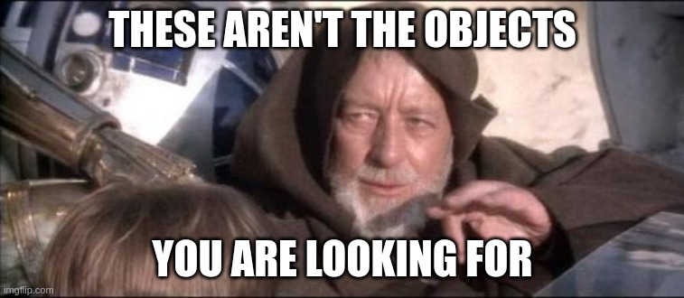

# JavaScript Objects
tags: #dsw #js #object

## Objetos

### ¿Qué son objetos en JS?
Los objetos en JS son un tipo de dato fundamental que permite almacenar entidades complejas. Permite de forma conjunta almacenar datos (variables) y funcionalidad (funciones); en la POO las variables y funciones son llamadas propiedades y métodos respectivamente.

Las propiedades son pares clave-valor donde la clave es un identificador (de tipo string) único dentro del objeto y el valor es cualquier construcción válida de JS incluyendo colecciones u otros objetos. 

### Propiedades

ejemplo:
```javascript
const person = {
  firstName: 'Someone',
  lastName: 'Random',
  age: 30,
  hobbies: ['reading', 'surfing', 'coding'],
  address: {
    street: '123 Mountain view st',
    city: {
	    zip: 816015,
	    name: 'Kunlun'
    },
    state: {
	    code: 63, 
	    name: 'Qinghai province'
	    },
    country: 'China'
  }
};

```

En este ejemplo hemos definido un objeto literal con las propiedades:
* firstName, lastName y age: valores atómicos de tipo string, string y number.
* hobbies: es un array de string.
* address: un objeto que a su vez tiene otras propiedades (y objetos internos)

#### Uso
En JS hay dos formas de acceder a las propiedades: notación punto o corchete.

Con la notación punto se utiliza un punto para conectar el objeto con la propiedad y con la notación corchete se indican las propiedades como se accede a un array y la clave es un string con el nombre de la propiedad.

ejemplo:
```javascript
const person = {
  firstName: 'Someone',
  lastName: 'Random',
  age: 30,
  hobbies: ['reading', 'surfing', 'coding'],
  address: {
    street: '123 Mountain view st',
    city: {
      zip: 816015,
      name: 'Kunlun',
    },
    state: {
      code: 63,
      name: 'Qinghai province',
    },
    country: 'China',
  },
};

console.log('dot notation');
console.log(`${person.firstName} lives in ${person.address.city.name}, and is ${person.age}`);

console.log('change age');
person.age = 31;
console.log(`${person.firstName} lives in ${person.address.city.name}, and is ${person.age}`);

console.log('bracket notation');
person['age'] = 40;
console.log(`${person['firstName']} lives in ${person['address']['city']['name']}, and is ${person['age']}`);
```

Salida:
```bash
$ node 02.01-objectsProperties.js 
dot notation
Someone lives in Kunlun, and is 30
change age
Someone lives in Kunlun, and is 31
bracket notation
Someone lives in Kunlun, and is 40
create properties
Someone lives in Kunlun, and is 40 who works as a developer
```

#### Nuevas propiedades
Además de crear objetos con propiedades de forma literal se pueden agregar nuevas propiedades de forma dinámica:
```javascript
console.log('create properties');
person.job = 'developer';
console.log(
  `${person['firstName']} lives in ${person['address']['city']['name']}, and is ${person['age']} who works as a ${person.job}`
);
```

Salida:
```bash
create properties
Someone lives in Kunlun, and is 40 who works as a developer
```


### Métodos
Los métodos a diferencia de las propiedades que solo contienen datos los métodos permiten modelar comportamiento. Son funciones que se definen de manera similar a las propiedades y son ejecutados al invocar a la key seguida de (). Los paréntesis pueden tener dentro cero, uno o más parámetros

Ejemplo:
```javascript
const person = {
  firstName: 'Someone',
  lastName: 'Random',
  birthDate: new Date('1993-01-10'),
  getAge() {
    return Math.floor((new Date() - this.birthDate.getTime()) / 3.15576e10);
  },
  getAgeToDate(someDate) {
    return Math.floor((someDate - this.birthDate.getTime()) / 3.15576e10);
  },
  hobbies: ['reading', 'surfing', 'coding'],
  address: {
    street: '123 Mountain view st',
    city: {
      zip: 816015,
      name: 'Kunlun',
    },
    state: {
      code: 63,
      name: 'Qinghai province',
    },
    country: 'China',
    getFullAddress() {
      return `${this.street}, ${this.city.name}, ${this.state.name},${this.country}`;
    },
  },
};

console.log(person.address.getFullAddress());
console.log(person.getAge());
console.log(person.getAgeToDate(new Date('2020-01-01')));
```

Salida
```bash
$ node 02.02-objectMethods.js 
123 Mountain view st, Kunlun, Qinghai province,China
30
26
```

### Disculpe, estoy buscando la Clase de este objeto....

Hasta ahora hemos creado un objeto literal con propiedades, hemos agregado nuevas propiedades y hemos definido e ínvocado métodos...pero no hemos definido ninguna clase ni nada que se le parezca. ¿Los objetos no se crean a partir de una clase? ¿Dónde están las clases?



En la POO tradicional los objetos se crean a partir de clases pero en JS esto no es necesario. En JS existe algo llamado prototipos y herencia prototípica (que mencionaremos más en detalle luego). Donde un objeto en lugar de referenciar a una clase lo hace a un prototipo que no es más que otro objeto.

Es decir que los objetos no tienen clases en JS.

**Disclaimer**: En versiones más recientes de JS se agregó nueva sintaxis para definir clases y herencia de la forma tradicional de POO.

Se puede acceder a ... (notación punto o corchete)